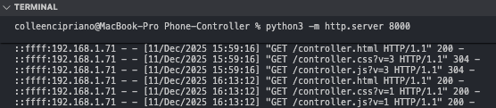

# Accessible Mobile Phone Controller (ASCU) for Unity

This folder contains a **web-based mobile controller** that lets a smartphone act as an **accessible input device** for a Unity game. The phone sends high-level gestures (swipes, taps, holds) to Unity over WebSockets, and receives feedback (text-to-speech prompts, state changes) from Unity.

## 1. Project Overview

The phone controller runs entirely in the browser (HTML/CSS/JS) on a mobile device:

* The **phone screen is the “controller surface”** — players swipe and tap anywhere on the screen.
* The page connects to the Unity game via **WebSockets** (default `ws://<host>:8081`).
* Unity sends structured events (e.g., menu focus, game start, checkpoints) back to the phone.
* The phone uses **text-to-speech (TTS)** to read those events to the player.
* It strongly encourages **landscape orientation** and includes an overlay and spoken hints to guide the user.

The Unity side (on a separate folder) is responsible for:

* Hosting a WebSocket server.
* Translating received gestures into in-game actions.
* Sending feedback events (with TTS text) back to the phone.

---

## 2. Files in This Project

* `controller.html` – The main phone client page (UI text, status label, rotate overlay, debug buttons). 
* `controller.css` – Minimal styling for the full-screen controller, rotate overlay, and debug UI. 
* `controller.js` – Core logic:

  * WebSocket connection to Unity.
  * Gesture recognition.
  * Mode switching (menu vs game).
  * Orientation handling and TTS feedback. 

---

## 3. How It Connects to Unity

### 3.1 WebSocket Connection

On load, the JS creates a WebSocket connection:

```js
const HARDCODED_WS_URL = ""; 

function getWebSocketURL() {
  if (HARDCODED_WS_URL) return HARDCODED_WS_URL;

  const protocol = location.protocol === "https:" ? "wss://" : "ws://";
  return protocol + location.hostname + ":8081";
}
```

* If `HARDCODED_WS_URL` is empty, it connects to `ws://<phone-page-host>:8081`.
* If you’re tunnelling (e.g., via ngrok) or hosting Unity elsewhere, you can **set `HARDCODED_WS_URL`** to a full WebSocket URL (e.g., `wss://my-tunnel-url/ws`). 

Unity must implement a matching WebSocket server that:

* Accepts JSON objects from the phone.
* Sends JSON messages back when game/menu events occur.

---

### 3.2 Messages: Phone → Unity

Every gesture is sent as a simple JSON payload:

```json
{
  "type": "input",
  "gesture": "swipe_up"
}
```

The `gesture` field is one of:

**Menu mode (main menu, etc.):**

* `swipe_up`
* `swipe_down`
* `tap`
* `double_tap`

**Game mode (after “Start Game” is activated):**

* `hold_left_start`, `hold_left_end`
* `hold_right_start`, `hold_right_end`
* `tap`, `double_tap`

Unity maps these to whatever in-game actions make sense (e.g., move left/right, jump, higher jump on double-tap). 

---

### 3.3 Messages: Unity → Phone

Unity sends JSON messages like:

```json
{
  "eventId": "menu_focus",
  "tts": "Start game",
  "priority": 1
}
```

The phone uses:

* `eventId` – What kind of event this is (e.g., `menu_focus`, `menu_activate`, `checkpoint_reached`).
* `tts` – Text to speak via the browser’s `speechSynthesis` API. 

Special behaviours:

* `menu_*` events → phone assumes it’s in **menu mode**.
* Non-`menu_*` events → phone assumes it’s in **game mode**.
* `menu_activate`:

  * Marks entry into game mode.
  * Speaks a **game intro** explaining:

    * Screen rotation advice.
    * How to use the top/bottom parts of the screen for movement and jumping.
  * After the intro finishes, the phone sends `gesture: "intro_done"` back to Unity, so Unity knows it can start SFX. 
* `checkpoint_reached`:
  * Speaks any supplied `tts` text.

---

## 4. Modes & Gesture Mapping

### 4.1 Menu Mode (Main Menu / UI Navigation)

In menu scenes, the phone:

* Treats the whole screen as a single gesture surface.
* Detects:

  * Vertical swipes: `swipe_up` / `swipe_down` (move through menu options).
  * Horizontal swipes: `swipe_left` / `swipe_right` (if you choose to use them).
  * `tap` / `double_tap` for selection/activation. 

Unity typically:

* Responds to `swipe_up` / `swipe_down` by changing focus.
* Announces the newly focused button by sending `eventId: "menu_focus"` + `tts` label.
* Responds to `double_tap` (or `tap`, if you choose) by activating the focused item and sending `eventId: "menu_activate"`.

The HTML includes a small status text and optional debug buttons (`Test menu_focus` and `Test menu_activate`).

---

### 4.2 Game Mode (Exploration / Platforming)

After `menu_activate` triggers game start:

* The script switches to **game mode**.
* It uses **multi-touch** with role separation:

  * **Movement finger**:

    * Assigned to the first finger down.
    * If it lands on the left half of the screen → `hold_left_start` sent.
    * If it lands on the right half → `hold_right_start`.
    * When that finger lifts → corresponding `_end` event is sent.
  * **Action finger**:

    * Second finger down (different touch ID from movement).
    * Used for:

      * `tap` / `double_tap` for jumps.
      * Swipes (`swipe_up`, etc.) for other actions.

This setup supports “hold left/right to walk” with simultaneous taps/swipes for jumping or other actions. 

---

## 5. Orientation & Accessibility

### 5.1 Landscape Requirement

The controller is **usable only in landscape**:

* On every resize/orientation change, the script checks `window.innerWidth > window.innerHeight`.
* If the phone is in portrait:

  * The full-screen `#rotateHint` overlay appears with text like:

    > “Game mode is best in landscape orientation. Please rotate your device to landscape to use the controller.”
  * No gestures are sent to Unity while in portrait.

### 5.2 TTS Hint in Portrait

To support blind or low-vision users who might not see the overlay:

* A quick tap in portrait triggers a spoken hint:

  * “Turn off screen rotation lock, and rotate your phone to landscape to use it as a controller.”
* This is handled completely on the browser side with `speechSynthesis`. 

---

## 6. Styling & Layout

`controller.css` keeps the UI minimal and full-screen:

* Removes scrolling and selection to avoid accidental zoom/selection.
* Centers the main content vertically and horizontally.
* Uses a full-screen fixed `#rotateHint` with black background and large white text.
* Includes `#debugControls` fixed at the bottom for test buttons.

You can safely customize fonts, colors, and layout while keeping:

* `#rotateHint` as a full overlay.
* `#status` as a small status indicator.
* `#debugControls` for development only.

---

## 7. Running the Controller
Serve `controller.html`, `controller.css`, and `controller.js` from the same machine that runs Unity, over HTTP (for example, `python -m http.server 8080`). Then open `http://<your-computer-ip>:8080/controller.html` on your phone. Because the page and Unity are on the same host, the controller will automatically connect to `ws://<your-computer-ip>:8081`.

  
### 7.1 Basic Steps

1. **Serve the files**
   Put `controller.html`, `controller.css`, and `controller.js` on any static web server (e.g., `http-server`, a local dev server, or your Unity build’s web root).

2. **Configure Unity’s WebSocket server**

   * Start a WebSocket server on port `8081` (or update `HARDCODED_WS_URL` in `controller.js` to match your actual endpoint).
   * Implement:
     * Receiving `{"type":"input","gesture":"..."}` from the phone.
     * Sending feedback messages with `eventId` and optional `tts` fields.

3. **Open the controller on your phone**

   * On the phone, visit `http://<your-computer-ip>/<path>/controller.html`.
   * You should hear **“Phone connected.”** when the WebSocket opens successfully. 

4. **Navigate the menu & game**

   * Use swipes/taps to navigate the main menu.
   * After **“Start Game,”** follow spoken instructions to use landscape two-finger controls.

---

## 8. Adapting to Other Projects

To reuse this controller in another Unity project:

* Keep the JSON protocol:

  * Phone → Unity: `{ type: "input", gesture: <string> }`.
  * Unity → Phone: `{ eventId: <string>, tts: <string>, ... }`.
* Map gestures to your own movement, jump, or ability systems.
* Customize TTS strings on the Unity side so menu and in-game prompts match your UI and mechanics.
* Optionally:

  * Add more `eventId` types for hazards, collectibles, or tutorial cues.
  * Extend the gesture set (e.g., three-finger tap) by updating `controller.js` and your Unity input handling.
